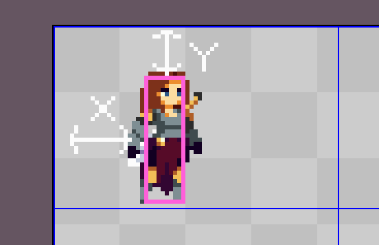

## Uh.. Spronk?

Spronk is an animation library for love2d. It aims to be simple to use, but as versatile as it possibly can.

## Usage

First, require spronk

```lua
local spronk = require "path.to.spronk"
```

Now create an instance. This requires the frame width, frame height and spritesheet

```lua
local sheet = love.graphics.newImage("sheet.png")
local spr = spronk.new(24, 48, sheet)
```

You can now begin adding your animations. Spronk will set the current animation to whatever you add first.

```lua
spr:add_state("idle", {
	row = 1,
	frames = '1-4',
	duration = 0.8
})
```

`add_state` supports quite a few options, but all you need is row and frames. You'll most likely want to set a duration, but it will use a default if you don't set one.
You can even set the frow in the frames string. This is useful if your animation is split over multiple rows in the spritesheet.

```lua
spr:add_state("run", {
	frames = '2:1-6, 3:1-2',
	duration = 0.6
})
```

Yeah, that's pretty freaking cool. The syntax is 'row:frames, row:frames'. If you want to go in reverse, you can set the range going from high to low, like `4-1`.

Callbacks can trigger during each frame or once an animation has finished. Simply use `on_frame` or `on_complete`

```lua
spr:add_state("shoot", {
	row = 2,
	frames = '1-3',
	on_complete = function()
		print("i has shotted")
	end
})
```

By default animations are set to loop. If you want them to play once and pause at the end, simply pass the option `loop = false`

To change the state, simply call `set_state`, ie: `spr:set_state("jump")`

### Bounding Boxes

Generally in games, an actual sprite won't use up the entire frame in a spritesheet. To ensure you can flip sprites around the center and they follow the actual collision box of the player/entity, you can set the bounding box with spronk so it's aware of it.

```lua
spr = spronk.new(69, 44, spritesheet)

spr:set_bbox({
	x = 22, -- x offset
	y = 12, -- y offset
	w = 10, -- bbox width
	h = 31  -- bbox height
})
```

In the above example, the bbox width and height are the dimensions of the actual player/entity, and the x/y offsets are the unused space around the bounding box. Here's a visual example of what it looks like in Aseprite.



This means, once you `spr:draw(x, y)`, spronk will handle all the necessary rendering to ensure your sprite looks as it should, no matter what state it's in, or how it's flipped.

### What's next?

Okay, so you've set up spronk with your animations. Now you need to update and draw them. It's very simple.

```lua
function love.update(dt)
    -- update spronk with dt
    spr:update(dt)
end

function love.draw()
    -- draw your sprite at x, y
    spr:draw(x, y)
end
```

### Other stuff

- **flip_h(bool)** - Flip horizontally
- **flip_v(bool)** - Flip vertically
- **set_rotation(number)** - Set rotation
- **set_scale(number_x, number_y)** - Set the x and y scale
